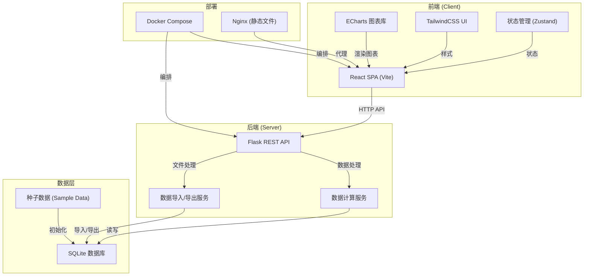
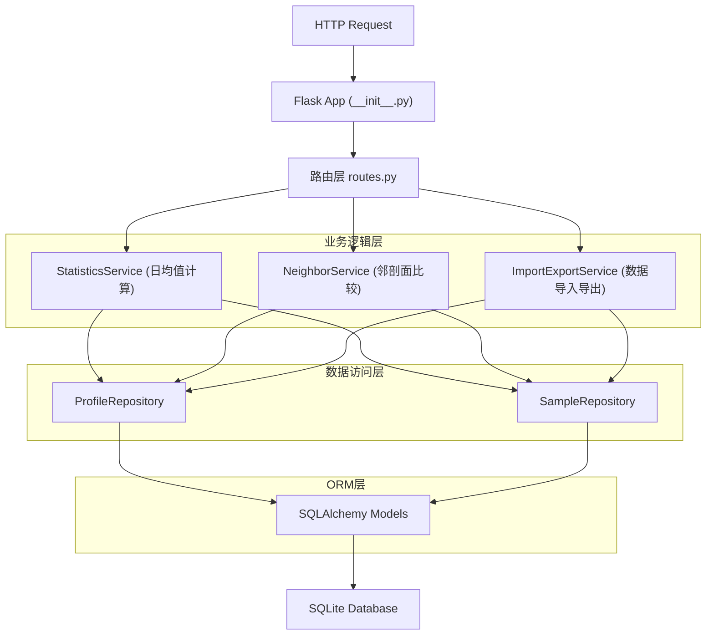
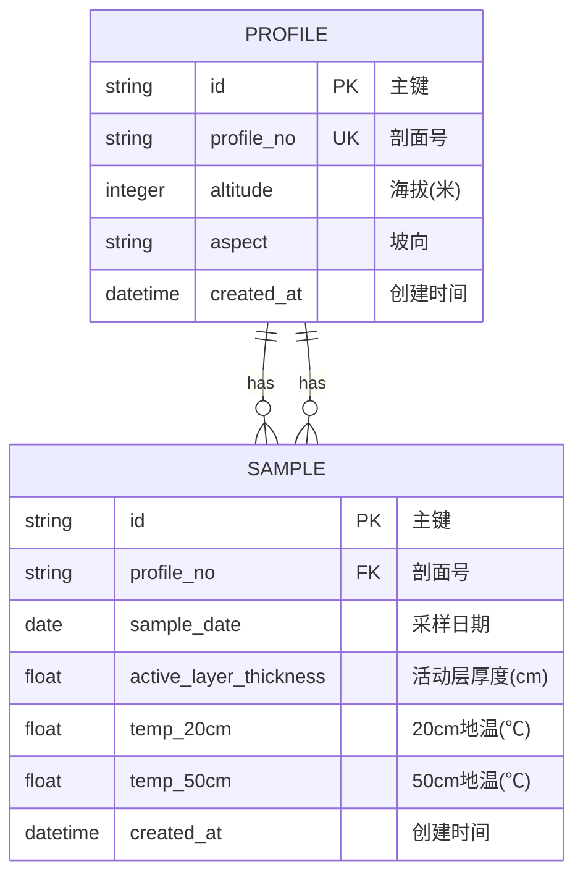

## 1. 架构设计



## 2. 技术描述

### 2.1 技术栈选择

| 层级 | 技术 | 版本 | 选型理由 |
|------|------|------|---------|
| 前端 | React | 18.x | 组件化开发，生态成熟 |
| 前端 | TypeScript | 5.x | 类型安全，减少运行时错误 |
| 前端 | Vite | 5.x | 快速构建，开发体验好 |
| 前端 | TailwindCSS | 3.x | 原子化CSS，快速构建UI |
| 前端 | ECharts | 5.x | 专业图表库，支持科研数据可视化 |
| 前端 | Zustand | 4.x | 轻量状态管理，简单易用 |
| 前端 | Lucide React | 0.x | 现代化图标库 |
| 后端 | Python | 3.11 | 适合科学计算和数据处理 |
| 后端 | Flask | 3.x | 轻量Web框架，灵活易扩展 |
| 后端 | SQLAlchemy | 2.x | ORM数据映射 |
| 后端 | pandas | 2.x | 数据聚合和分析 |
| 数据库 | SQLite | 3.x | 无需单独部署，适合本地科研应用 |
| 部署 | Docker | latest | 一键部署，环境一致性 |
| 部署 | Docker Compose | latest | 多容器编排 |
| 部署 | Nginx | latest | 静态资源服务和反向代理 |

### 2.2 目录结构

```
project/
├── .trae/documents/          # 项目文档
├── backend/                  # 后端服务
│   ├── app/
│   │   ├── __init__.py
│   │   ├── models.py         # 数据模型
│   │   ├── routes.py         # API路由
│   │   ├── services.py       # 业务逻辑
│   │   ├── schemas.py        # 数据校验
│   │   └── seed_data/        # 种子数据
│   ├── data/                 # SQLite数据库文件
│   ├── requirements.txt      # Python依赖
│   ├── config.py             # 配置文件
│   └── run.py                # 启动入口
├── frontend/                 # 前端应用
│   ├── src/
│   │   ├── components/       # React组件
│   │   ├── pages/            # 页面组件
│   │   ├── store/            # Zustand状态
│   │   ├── services/         # API服务
│   │   ├── utils/            # 工具函数
│   │   ├── types/            # TypeScript类型
│   │   └── App.tsx
│   ├── package.json
│   ├── tailwind.config.js
│   └── vite.config.ts
├── docker-compose.yml        # Docker编排
├── nginx.conf                # Nginx配置
└── README.md                 # 项目说明
```

## 3. 路由定义

### 3.1 前端路由

| 路由 | 页面 | 说明 |
|------|------|------|
| `/` | 看板主页 | 数据筛选、多图表展示、剖面示意 |
| `/import` | 数据导入页 | 新采样数据CSV导入 |

### 3.2 后端API路由

| Method | Route | 说明 |
|--------|-------|------|
| GET | `/api/profiles` | 获取监测剖面列表 |
| GET | `/api/profiles/:id` | 获取单个剖面详情 |
| GET | `/api/samples` | 获取采样记录（支持筛选） |
| GET | `/api/statistics/daily` | 获取日均值统计数据 |
| GET | `/api/statistics/neighbor-diff` | 获取邻剖面厚度差值 |
| GET | `/api/aspects` | 获取所有坡向列表 |
| GET | `/api/date-range` | 获取数据日期范围 |
| POST | `/api/samples/import` | 批量导入采样数据 |
| GET | `/api/export` | 导出当前筛选结果 |

## 4. API 定义

### 4.1 TypeScript 类型定义

```typescript
// 监测剖面
interface Profile {
  id: string;
  profileNo: string;      // 剖面号
  altitude: number;       // 海拔(米)
  aspect: string;         // 坡向
}

// 采样记录
interface Sample {
  id: string;
  profileNo: string;
  sampleDate: string;     // YYYY-MM-DD
  activeLayerThickness: number;  // 活动层厚度(cm)
  temp20cm: number;       // 地表下20cm地温(℃)
  temp50cm: number;       // 地表下50cm地温(℃)
}

// 日均值统计
interface DailyStats {
  profileNo: string;
  date: string;
  avgThickness: number;   // 活动层厚度日均值
  avgTempDiff: number;    // (50cm-20cm)地温差日均值
}

// 剖面统计汇总
interface ProfileStats {
  profileNo: string;
  aspect: string;
  altitude: number;
  periodAvgThickness: number;    // 时段内平均厚度
  periodAvgTempDiff: number;     // 时段内平均温差
  sampleCount: number;           // 采样数
}

// 邻剖面差值
interface NeighborDiff {
  profileNo1: string;
  profileNo2: string;
  aspect: string;
  altitudeDiff: number;
  thicknessDiff: number;         // 厚度均值差
}

// 筛选参数
interface FilterParams {
  aspects: string[];
  startDate: string;
  endDate: string;
}
```

### 4.2 请求响应示例

**GET /api/statistics/daily?aspects=北坡&aspects=南坡&startDate=2024-05-01&endDate=2024-09-30**

```json
{
  "code": 200,
  "data": {
    "profileStats": [
      {
        "profileNo": "P001",
        "aspect": "北坡",
        "altitude": 4200,
        "periodAvgThickness": 85.6,
        "periodAvgTempDiff": 2.3,
        "sampleCount": 45
      }
    ],
    "dailyData": [
      {
        "profileNo": "P001",
        "date": "2024-05-01",
        "avgThickness": 82.5,
        "avgTempDiff": 1.8
      }
    ]
  }
}
```

## 5. 服务器架构图



## 6. 数据模型

### 6.1 ER 图



### 6.2 DDL 语句

```sql
-- 监测剖面表
CREATE TABLE profile (
    id VARCHAR(36) PRIMARY KEY,
    profile_no VARCHAR(50) UNIQUE NOT NULL,
    altitude INTEGER NOT NULL,
    aspect VARCHAR(20) NOT NULL,
    created_at DATETIME DEFAULT CURRENT_TIMESTAMP,
    INDEX idx_aspect (aspect),
    INDEX idx_altitude (altitude)
);

-- 采样记录表
CREATE TABLE sample (
    id VARCHAR(36) PRIMARY KEY,
    profile_no VARCHAR(50) NOT NULL,
    sample_date DATE NOT NULL,
    active_layer_thickness FLOAT NOT NULL,
    temp_20cm FLOAT NOT NULL,
    temp_50cm FLOAT NOT NULL,
    created_at DATETIME DEFAULT CURRENT_TIMESTAMP,
    FOREIGN KEY (profile_no) REFERENCES profile(profile_no) ON DELETE CASCADE,
    INDEX idx_profile_date (profile_no, sample_date),
    INDEX idx_sample_date (sample_date)
);
```

### 6.3 种子数据结构

**监测剖面种子数据 (profiles.csv)**
```csv
profile_no,altitude,aspect
P001,4200,北坡
P002,4350,北坡
P003,4500,北坡
P004,4250,南坡
P005,4400,南坡
P006,4550,南坡
P007,4300,东坡
P008,4450,东坡
P009,4200,西坡
P010,4400,西坡
```

**采样记录种子数据 (samples.csv)**
```csv
profile_no,sample_date,active_layer_thickness,temp_20cm,temp_50cm
P001,2024-05-01,80.5,3.2,5.0
P001,2024-05-02,81.2,3.5,5.3
P001,2024-05-03,82.0,3.8,5.6
...
```

### 6.4 核心计算逻辑

1. **活动层厚度日均值**：按剖面号+日期分组，计算活动层厚度平均值
2. **地温差日均值**：按剖面号+日期分组，计算(temp_50cm - temp_20cm)的平均值
3. **邻剖面判定**：同坡向内按海拔排序，相邻海拔的剖面互为邻剖面
4. **邻剖面厚度差**：同一时段内，两邻剖面的时段平均厚度差值
